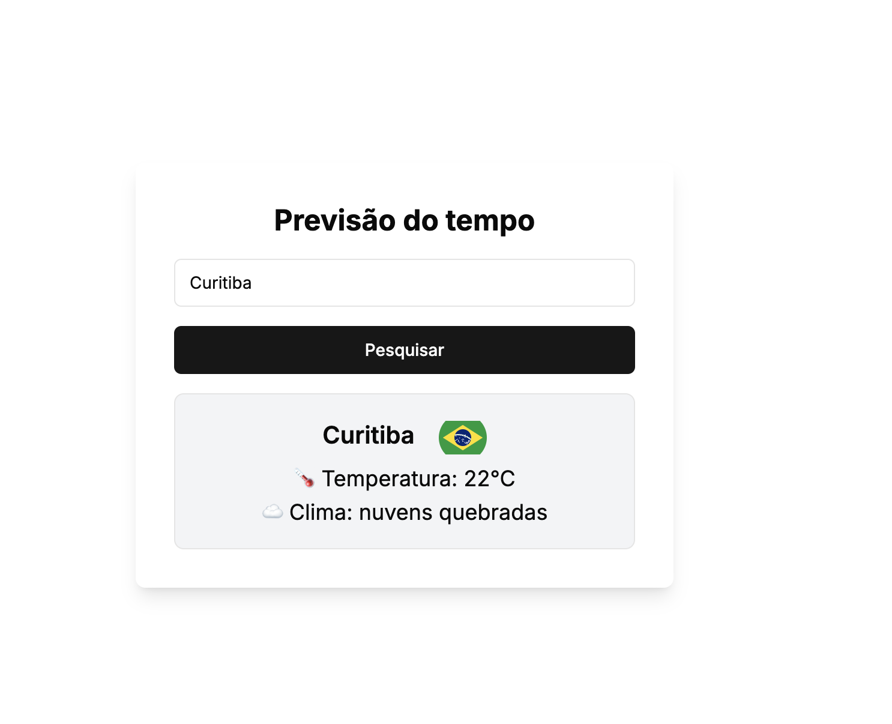

## Previsão do Tempo - Weather Forecast
Projeto feito em [React](https://react.dev/) com [Next.js](https://nextjs.org), [shadcn/ui](https://ui.shadcn.com/) e [TailwindCSS](https://tailwindcss.com/).
##
BackEnd é consultado pelo site [openweathermap](https://openweathermap.org/)
##
Biblioteca de testes é o [Jest](https://jestjs.io/pt-BR/)
##

## Getting Started

```bash
npm i
Adicionar um .env na raiz do projeto
NEXT_PUBLIC_API_URL='https://api.openweathermap.org/data/2.5/'
NEXT_PUBLIC_API_KEY='sua chave'
npm run dev
```

